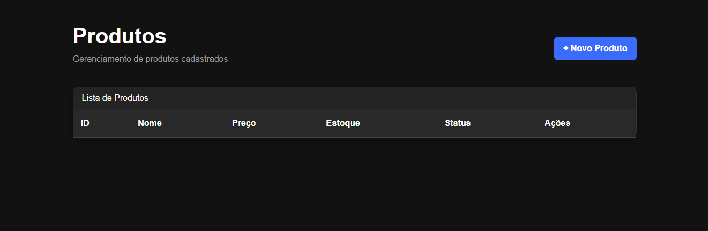
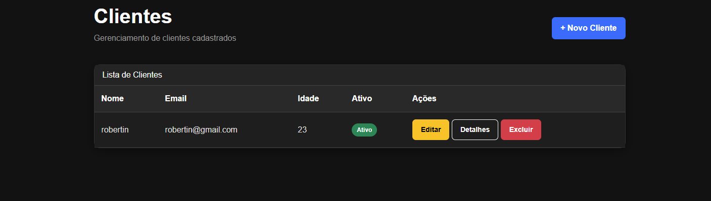
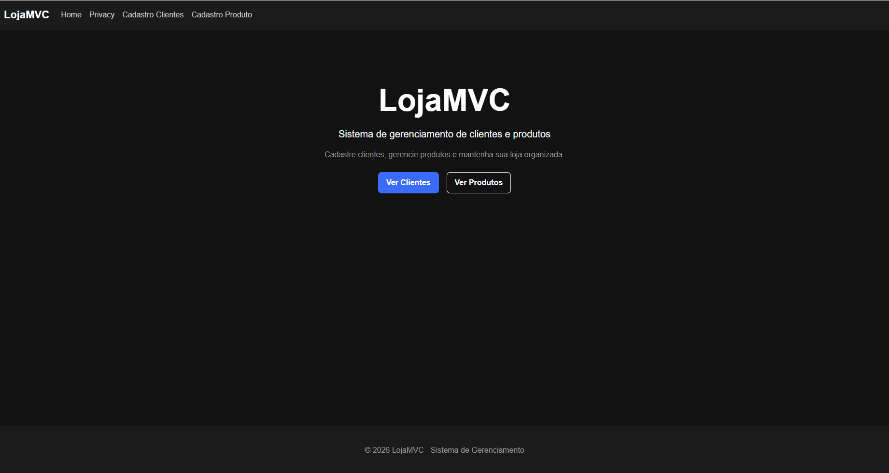

# LojaMVC

Sistema desenvolvido em **ASP.NET Core MVC** utilizando a linguagem **C#** e o padrão arquitetural **Model-View-Controller (MVC)**.

O projeto tem como objetivo demonstrar a implementação de um sistema CRUD (Create, Read, Update e Delete) para gerenciamento de **clientes e produtos**, utilizando boas práticas de desenvolvimento, persistência de dados com Entity Framework Core, interface responsiva com Bootstrap e testes automatizados utilizando a metodologia **TDD (Test-Driven Development)**.

---

## Tecnologias Utilizadas

- C#
- .NET
- ASP.NET Core MVC
- SQL Server
- Entity Framework Core
- Bootstrap 5
- HTML5
- CSS3
- Razor
- xUnit
- TDD (Test-Driven Development)

---

## Arquitetura do Projeto

O projeto foi desenvolvido utilizando o padrão arquitetural **Model-View-Controller (MVC)**.

### Model

Responsável pela representação dos dados e pelas regras de negócio da aplicação.

O projeto possui os modelos:

- `Cliente`
- `Produto`

### View

Responsável pela interface apresentada ao usuário.

Foram utilizadas **Razor Views**, HTML, CSS e Bootstrap para construção das telas.

### Controller

Responsável por receber as requisições do usuário, processar as informações e realizar a comunicação entre os Models e as Views.

---

## Funcionalidades

### Clientes

O sistema permite:

- Cadastro de clientes
- Consulta de clientes
- Alteração de registros
- Exclusão de registros
- Visualização dos detalhes
- Validação das informações
- Controle do status do cliente como ativo ou inativo

Os clientes possuem informações como:

- Nome
- Email
- Idade
- Status

### Produtos

O sistema permite:

- Cadastro de produtos
- Consulta de produtos
- Alteração de registros
- Exclusão de registros
- Visualização dos detalhes
- Validação das informações
- Controle de estoque

Os produtos possuem informações como:

- ID do produto
- Nome
- Preço
- Estoque

---

# CRUD

O sistema implementa as quatro operações principais de um CRUD:

### Create

Permite cadastrar novos clientes e produtos através dos formulários de cadastro.

### Read

Permite consultar e visualizar os registros cadastrados através das tabelas de clientes e produtos.

### Update

Permite editar os dados dos clientes e produtos já cadastrados.

### Delete

Permite excluir clientes e produtos cadastrados, com uma tela de confirmação antes da exclusão.

---

# TDD - Test-Driven Development

Durante o desenvolvimento do projeto foi utilizada a metodologia **TDD (Test-Driven Development)**.

O TDD foi aplicado principalmente no desenvolvimento e validação das regras de negócio dos Models.

Através dos testes automatizados foi possível verificar diferentes situações antes de considerar as funcionalidades concluídas.

Foram utilizados testes com **xUnit** para verificar as regras de validação.

Entre os testes desenvolvidos estão:

- Verificação de cliente válido
- Verificação de cliente com idade inválida
- Verificação de email inválido
- Verificação de cliente sem nome
- Validação de informações dos produtos

Exemplo de teste realizado no projeto:

```csharp
[Fact]
public void Verifica_Email_Invalido()
{
    var cliente = new Cliente
    {
        Nome = "Robertin",
        Email = "robertin@gmail.com",
        Idade = 20,
        Ativo = true
    };

    var resultado = cliente.Validation();

    Assert.False(resultado);
}
```

---

# Banco de Dados

O projeto utiliza **SQL Server** para armazenamento dos dados.

A comunicação com o banco de dados é realizada através do **Entity Framework Core**.

Foi utilizada a abordagem **Code First**, permitindo que as classes do projeto sejam utilizadas como base para criação e atualização da estrutura do banco.

---

## Entity Framework Core

O Entity Framework Core foi utilizado para:

- Conectar a aplicação ao banco de dados
- Criar e manipular tabelas
- Inserir registros
- Consultar registros
- Atualizar registros
- Excluir registros
- Gerenciar migrations

---

# Interface

A interface foi desenvolvida utilizando **Bootstrap 5**, juntamente com HTML, CSS e Razor.

O sistema possui um layout com:

- Tema escuro
- Barra de navegação
- Tabelas estilizadas
- Cards
- Botões de ação
- Formulários de cadastro
- Formulários de edição
- Tela de confirmação de exclusão
- Layout responsivo

---

# Telas do Sistema

## Tela Inicial

A tela inicial apresenta o sistema e disponibiliza acesso às principais áreas da aplicação.



---

## Cadastro de Clientes

Tela utilizada para realizar o cadastro de novos clientes.



---

## Cadastro de Produtos

Tela utilizada para realizar o cadastro de novos produtos.



---

# Testes Automatizados

Os testes automatizados foram desenvolvidos utilizando **xUnit** e têm como objetivo verificar o funcionamento das regras de validação dos Models.

Os testes podem ser executados diretamente pelo **Test Explorer** do Visual Studio ou através do terminal.

```bash
dotnet test
```

Entre os testes realizados estão verificações de dados válidos e inválidos dos clientes e produtos.

Os testes ajudam a garantir que as regras de negócio estejam funcionando corretamente e auxiliam na identificação de possíveis erros durante o desenvolvimento.

---

# Validações

O projeto possui regras de validação para impedir o cadastro de informações inválidas.

### Cliente

O cliente deve possuir:

- Nome preenchido
- Email válido
- Idade válida

### Produto

O produto deve possuir:

- Nome preenchido
- Preço maior que zero
- Estoque maior que zero

Exemplo da validação do produto:

```csharp
public bool Validation()
{
    return Preco > 0 &&
           Estoque > 0 &&
           !string.IsNullOrEmpty(Nome);
}
```

---

# Estrutura do Projeto

```text
LojaMVC
│
├── Controllers
│   ├── ClientesController.cs
│   ├── ProdutosController.cs
│   └── HomeController.cs
│
├── Models
│   ├── Cliente.cs
│   └── Produto.cs
│
├── Views
│   ├── Clientes
│   │   ├── Index.cshtml
│   │   ├── Create.cshtml
│   │   ├── Edit.cshtml
│   │   ├── Details.cshtml
│   │   └── Delete.cshtml
│   │
│   ├── Produtos
│   │   ├── Index.cshtml
│   │   ├── Create.cshtml
│   │   ├── Edit.cshtml
│   │   ├── Details.cshtml
│   │   └── Delete.cshtml
│   │
│   └── Home
│       └── Index.cshtml
│
├── Data
│
├── Migrations
│
├── wwwroot
│   ├── css
│   └── js
│
├── imagens
│   ├── tela_inicial.png
│   ├── cadastro_cliente.png
│   └── cadastro_produto.png
│
├── Program.cs
├── appsettings.json
└── LojaMVC.csproj
```

---

# Como Executar o Projeto

## Clone o repositório

```bash
git clone https://github.com/SEU-USUARIO/LojaMVC.git
```

Depois entre na pasta do projeto:

```bash
cd LojaMVC
```

---

## Abra a solução

Abra o projeto utilizando o **Visual Studio 2022**.

Abra o arquivo:

```text
LojaMVC.sln
```

---

## Configure a conexão

Edite o arquivo:

```text
appsettings.json
```

Configurando a string de conexão para o seu SQL Server.

Exemplo:

```json
{
  "ConnectionStrings": {
    "DefaultConnection": "Server=localhost;Database=LojaMVC;Trusted_Connection=True;TrustServerCertificate=True;"
  }
}
```

---

## Restaure os pacotes

Execute:

```bash
dotnet restore
```

---

## Execute as Migrations

No Console do Gerenciador de Pacotes do Visual Studio execute:

```powershell
Update-Database
```

Ou utilize o .NET CLI:

```bash
dotnet ef database update
```

---

## Execute o projeto

Pressione **F5** no Visual Studio ou clique em **Iniciar**.

O navegador será aberto automaticamente com a aplicação.

---

# Executando os Testes

Para executar os testes automatizados:

```bash
dotnet test
```

Também é possível executar os testes através do **Test Explorer** do Visual Studio.

---

# Objetivo do Projeto

Este projeto foi desenvolvido com o objetivo de praticar e demonstrar conhecimentos em:

- Desenvolvimento web com ASP.NET Core
- Arquitetura MVC
- Programação em C#
- Desenvolvimento de sistemas CRUD
- Entity Framework Core
- Banco de dados SQL Server
- Razor Views
- Bootstrap
- HTML e CSS
- Testes automatizados
- TDD (Test-Driven Development)
- Validação de regras de negócio
- Organização de projetos web

---

# Desenvolvido com

- ASP.NET Core MVC
- C#
- SQL Server
- Entity Framework Core
- Bootstrap
- HTML5
- CSS3
- Razor
- xUnit
- TDD (Test-Driven Development)

---

# Autores

### Desenvolvedor

**Gabriel Silva de Almeida Ferreira**

### Professor

**Wallace Oliveira dos Santos**
